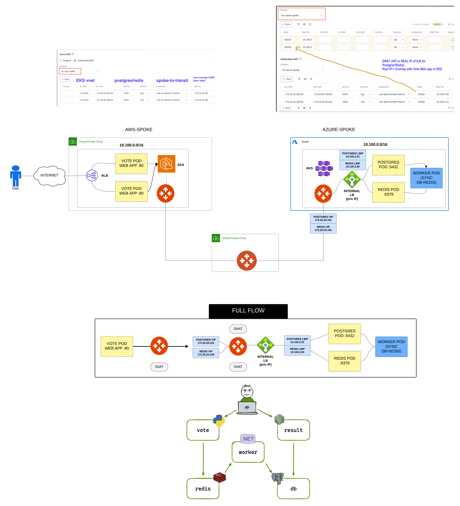

# aks-eks-overlap
# Multi‑Cloud EKS + AKS Deployment Notes

This repository provisions an **EKS cluster on AWS** and an **AKS cluster on Azure** and deploys a multi‑cluster Voting App across them.  

These notes capture key lessons, dependencies, and fixes discovered during development.
---



---

---

## ⚠️ Prerequisites & Credentials

- Ensure that **`~/.aws/credentials`** contains the same **AWS Access Key** and **Secret** as defined in `terraform.tfvars`.  
  - If they do not match, you will encounter authentication errors when using the generated EKS `kubeconfig` file.

---

## 🛠️ Dependencies & Ordering

- The Voting App depends on **both EKS and AKS clusters** being fully provisioned.  
- **Terraform does not automatically enforce this dependency.**  
- Add explicit `depends_on` relationships to ensure:
  - EKS/AKS clusters are deployed first.
  - The Voting App (and all `kubernetes_*` resources) is only deployed once their kubeconfig files are available.

---

## 🐛 Known Bugs & Workarounds

- **Context deadline exceeded** when attaching Aviatrix Spokes to Transits:  
  - Related tickets:  
    - [AVX‑64714]
    - [AVX‑64537]
  - Root cause: 30‑second timeout on attachment operations.   

- **Classic Load Balancer fallback**:  
  - If the NLB annotation is missing in an EKS Service definition, AWS defaults to provisioning a **Classic Load Balancer** (deprecated).  
  - This introduces a stalling issue (if you have more than 1 replica of the vote app, then 3-4 requests take 1 seconds, then 1-2 take 19-20 
  - Always set the correct annotation for NLB/ALB explicitly.

---

## 🐣 Chicken & Egg Problem (AKS + EKS kubeconfig)

- **Problem:**  
  - The `kubernetes` provider requires a valid kubeconfig file at plan/apply time.  
  - But kubeconfig only exists **after** the EKS/AKS clusters are created.  
  - Terraform plan does **not** fail (it defers file validation), but apply will fail when Kubernetes resources are created if the file is missing.

- **Solution:**  
  - Use a `null_resource` to generate kubeconfig files **after cluster creation**:  
    - **EKS:**  
      ```hcl
      resource "null_resource" "generate_kubeconfig_eks" {
        depends_on = [module.eks]
        provisioner "local-exec" {
          command = <<EOT
      aws eks update-kubeconfig \
        --region ${var.aws_region} \
        --name ${module.eks.cluster_name} \
        --kubeconfig ${path.module}/kubeconfig-eks.yaml
      EOT
        }
      }
      ```
    - **AKS:**  
      Use `az aks get-credentials --overwrite-existing`.

  - Set all `kubernetes_*` resources to `depends_on = [null_resource.generate_kubeconfig_<cluster>]` so they only apply after kubeconfig is generated.

- **Provider Example:**
  ```hcl
  provider "kubernetes" {
    alias       = "eks"
    config_path = "${path.module}/kubeconfig-eks.yaml"
  }

## 🔑 Aviatrix Azure Permissions for AKS Discovery

For Aviatrix to discover the AKS cluster, you must:

1. **Create a custom role** with the following permissions:
   - `Microsoft.ContainerService/managedClusters/read`
   - `Microsoft.ContainerService/managedClusters/listClusterUserCredential/action`
   - `Microsoft.ResourceGraph/resources/read`                  

2. **Assign this custom role** at the **Subscription level** to the **App Registration** used by the Aviatrix Controller.  
   - This is **in addition to** any existing role (e.g., `Contributor`) already assigned.

> 💡 Without these permissions, Aviatrix will not be able to discover or interact with the AKS cluster.
